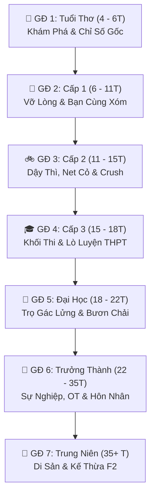

# MODULE 02: HỆ THỐNG 7 GIAI ĐOẠN CUỘC ĐỜI (LIFE STAGES)

---

## 1. Giai đoạn 1: Tuổi Thơ Xóm Nhỏ (4 – 6 tuổi)
* **Bối cảnh:** Căn nhà tuổi thơ, sân chơi xóm nhỏ, trường mẫu giáo có xích đu và cầu trượt.
* **Cơ chế chơi:** Tự do trải nghiệm (Offline), hình thành các chỉ số nền tảng.
* **Minigame & Hoạt động:**
  * Xếp gạch, vẽ tranh sáp màu, nặn đất sét $\rightarrow$ Tăng Sáng tạo (ART) & Trí tuệ (IQ).
  * Bắn bi, trốn tìm, đuổi bắt với bạn hàng xóm $\rightarrow$ Tăng Thể lực (STR) & Độ hòa đồng.
  * Nghe bà kể chuyện cổ tích, xem phim hoạt hình trên tivi cũ.
* **Sự kiện rẽ nhánh:** Vòi vĩnh đồ chơi ngoài chợ (Biết nghe lời mẹ $\rightarrow$ Tăng Ngoan ngoãn / Khóc ăn vạ $\rightarrow$ Tăng Bướng bỉnh); Bị chó đuổi (Tạo tính Gan dạ hoặc Sợ hãi).

---

## 2. Giai đoạn 2: Cấp 1 – Tuổi Vỡ Lòng (6 – 11 tuổi)
* **Bối cảnh:** Lớp học bàn gỗ khắc compa, khăn quàng đỏ, tiệm tạp hóa cổng trường.
* **Cơ chế chơi:** Nhận tiền tiêu vặt đầu đời (5.000đ – 10.000đ/ngày).
* **Minigame & Hoạt động:**
  * Luyện chữ đẹp, bấm phím nhanh giải toán bảng cửu chương.
  * Quà vặt cổng trường: Kem que, kẹo C hình trái tim, bánh tráng, xí muội.
  * Mua đồ chơi theo phong trào: Yoyo, con quay, thẻ bài ma thuật, máy nuôi thú ảo.
* **Sự kiện rẽ nhánh:** Giấu bài kiểm tra điểm kém hay nhận lỗi; Ngày họp phụ huynh cuối kỳ (nhận thưởng xe đạp mini hoặc ăn đòn roi).

---

## 3. Giai đoạn 3: Cấp 2 – Dậy Thì & Quán Net Cỏ (11 – 15 tuổi)
* **Bối cảnh:** Chiếc xe đạp cọc cạch, lò học thêm buổi tối, quán Net xóm phảng phất mùi mì tôm trứng.
* **Cơ chế chơi:**
  * Cân bằng giữa "Học sinh gương mẫu" và "Chỉ số Nổi loạn (Rebellion)".
  * Hệ thống Cảm Nắng (Crush): Thư tay kẹp ngăn bàn, mua trà sữa tặng bạn bàn bên.
  * Quán Net xóm: Bắn Half-Life, nhảy Audition, cày game nhập vai (giải tỏa 100% stress nhưng tụt hạnh kiểm nếu trốn học).
* **Sự kiện rẽ nhánh:** Kỳ thi chuyển cấp vào Lớp 10 (Trường Chuyên, Công lập top hay Dân lập).

---

## 4. Giai đoạn 4: Cấp 3 – Áo Dài Trắng & Ngã Rẽ Đại Học (15 – 18 tuổi)
* **Bối cảnh:** Tà áo dài trắng, bảng đen ngập công thức luyện thi, quán trà sữa tuổi teen, đêm bế giảng ve kêu.
* **Cơ chế chơi:**
  * Phân ban & Khối thi:
    * *Khối A (Toán-Lý-Hóa):* Kỹ thuật, Lập trình IT, Xây dựng.
    * *Khối B (Toán-Hóa-Sinh):* Ngành Y Dược, Nông sinh học.
    * *Khối C (Văn-Sử-Địa):* Báo chí, Sư phạm, Xã hội, Luật.
    * *Khối D (Toán-Văn-Anh):* Kinh tế, Ngoại thương, Marketing, Ngoại ngữ.
    * *Học Nghề / Xuất Khẩu Lao Động:* Đi làm sớm, tự lập tài chính ngay.
  * Quản lý năng lượng luyện thi: Cày đề xuyên đêm, áp lực kỳ thi Tốt nghiệp THPT Quốc Gia.
* **Sự kiện rẽ nhánh:** Tỏ tình trước ngày bế giảng; Nhận kết quả kỳ thi THPT.

---

## 5. Giai đoạn 5: Đời Sinh Viên – Phòng Trọ Gác Lửng & Mưu Sinh (18 – 22 tuổi)
* **Bối cảnh:** Phòng trọ 15m² gác lửng nóng bức, xe bus giờ cao điểm, căn tin trường, quán cafe part-time.
* **Cơ chế chơi:**
  * Quản lý ngân sách sinh viên: Tiền trọ + Điện nước + Tiền ăn + Học phí.
  * Nếu cạn tiền: Ăn mì tôm liên tục (tụt thể lực), chậm trả tiền phòng (bị chủ trọ nhắc nhở).
  * Tam giác cân bằng sinh tồn: `[Điểm GPA]` $\leftrightarrow$ `[Tiền Làm Thêm]` $\leftrightarrow$ `[Sức Khỏe / Giấc Ngủ]`.
  * Nghề part-time: Gia sư, phục vụ cafe, trực net, chạy xe ôm công nghệ, freelance đồ họa/code.
* **Mục tiêu cột mốc:** Mua xe máy cũ (Wave Alpha), sắm laptop cá nhân, tốt nghiệp bằng Giỏi/Khá.

---

## 6. Giai đoạn 6: Bước Vào Đời – Sự Nghiệp, Tài Sản & Hôn Nhân (22 – 35 tuổi)
* **Bối cảnh:** Tòa nhà cao ốc văn phòng, chung cư hiện đại, nhà hàng tiệc cưới, thị trường chứng khoán/bất động sản.
* **Cơ chế chơi:**
  * Leo thang sự nghiệp: Intern $\rightarrow$ Junior $\rightarrow$ Senior $\rightarrow$ Leader/Giám đốc $\rightarrow$ Mở doanh nghiệp riêng.
  * Bật chế độ "Siêu nhân OT" để tăng tốc thu nhập và săn thưởng KPI cuối năm.
  * Tình yêu & Hôn nhân: Hẹn hò trưởng thành, tổ chức đám cưới, đón con đầu lòng.
  * Đầu tư tài sản: Mua sắm trả góp căn hộ chung cư, mua ô tô, lướt sóng cổ phiếu.

---

## 7. Giai đoạn 7: Trung Niên & Di Sản Kế Thừa (35+ tuổi & Thế Hệ F2)
* **Bối cảnh:** Căn nhà ấm cúng đầy đủ tiện nghi, ban công trà đạo, phòng khách sum vầy con cháu.
* **Cơ chế chơi:**
  * Nuôi dạy con cái, chuẩn bị tài sản thừa kế, hoàn thành trách nhiệm với đại gia đình.
  * Nghỉ hưu an nhàn: Chăm sóc cây cảnh, câu cá, đọc sách.
  * Tổng kết "Thẻ Hồi Ký Cuộc Đời" (Life Summary Card).
  * Kích hoạt **New Game+ F2**: Chuyển giao tài sản thừa kế và gen thiên phú sang thế hệ đời con.
