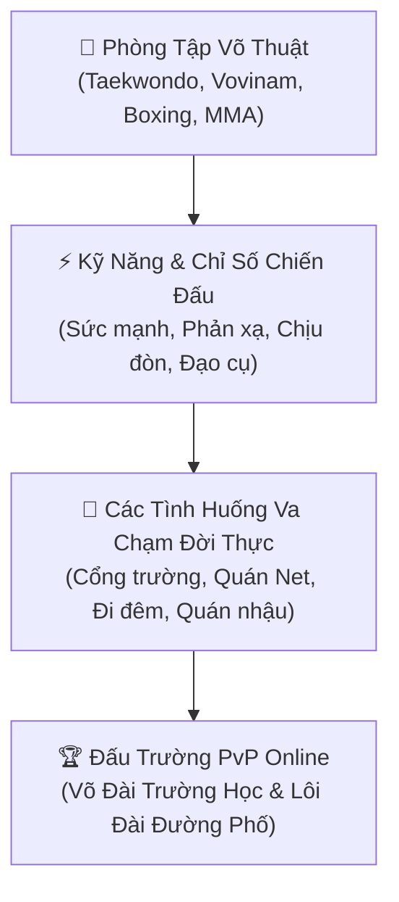

# MODULE 09: HỆ THỐNG HỌC VÕ, ĐÁNH LỘN & SINH TỒN ĐƯỜNG PHỐ (COMBAT & MARTIAL ARTS)



---

## 1. Triết Lý & Bối Cảnh: "Học Võ Try-Hard Để Sinh Tồn"
Trong đời sống thực tế, việc rèn luyện thể chất và học võ không chỉ để rèn luyện sức khỏe mà còn là **công cụ sinh tồn bắt buộc** để tự vệ, bảo vệ bạn bè, người thân và tài sản cá nhân trước các biến cố va chạm ngoài xã hội.

---

## 2. Hệ Thống Môn Phái & Lộ Trình Luyện Võ

| Môn võ / Lò luyện | Giai đoạn mở khóa | Chỉ số rèn luyện | Tuyệt chiêu đặc trưng |
| :--- | :--- | :--- | :--- |
| **Taekwondo / Karate** | Cấp 1 – Cấp 2 (Nhà thiếu nhi) | +Phản xạ, +Tốc độ đòn chân, +Nhanh nhẹn | *Song phi cước, Cú đá xoay vòng 360°* |
| **Vovinam / Võ Cổ Truyền** | Cấp 2 – Cấp 3 (CLB Trường học) | +Cận chiến, +Khóa siết, +Cân bằng | *Đòn kẹp cổ trứ danh, Đòn đấm phản công* |
| **Boxing (Quyền Anh)** | Sinh viên – Trưởng thành (Phòng Gym) | +Sức mạnh đấm (STR), +Tốc độ tay, +Né đòn | *Cú đấm móc hàm (Uppercut), Combo 1-2 Jab-Cross* |
| **Muay Thai / MMA** | Trưởng thành (Lò luyện thực chiến) | +Độ chịu đòn (DEF), +Sát thương chí mạng | *Đòn chỏ, Gối bay, Kỹ năng địa chiến (Ground & Pound)* |
| **Võ Đường Phố (Street Brawling)** | Tự học qua các trận va chạm | +Tận dụng địa hình, +Mẹo sinh tồn | *Ném cát mù mắt, Vung ghế nhựa, Dùng nón bảo hiểm* |

---

## 3. Các Tình Huống "Đánh Lộn" Theo Từng Giai Đoạn Cuộc Đời

### 🎒 Cấp 1: Bảo Vệ Bãi Chơi & Chống Bắt Nạt
* **Tình huống:** Đám bạn xóm khác lấn chiếm bãi bắn bi/sân bóng nhựa, bảo vệ bạn cùng bàn bị bắt nạt giật đồ ăn vặt cổng trường.
* **Hình thức:** Đánh lộn trẻ con (Vật lộn, ném dép, cào cấu). Thắng tăng điểm Tự Tin & Uy Tín với bạn bè xóm.

### 🚲 Cấp 2: Đại Chiến Cổng Trường & Va Chạm Quán Net
* **Tình huống:**
  * *"Hẹn 5h chiều sau cổng trường":* Xích mích học sinh, va chạm do nhìn đểu hoặc tranh giành bãi gửi xe đạp.
  * *Va chạm Quán Net Cỏ:* Bị chiếm máy, cúp điện đột ngột hoặc xích mích trong game bắn súng/leo rank.
* **Hình thức:** Đấu tay đôi hoặc đánh nhóm 3v3. Tận dụng cặp sách làm khiên chắn.

### 🎓 Cấp 3: Bảo Vệ Crush & Đại Chiến Giữa Các Trường
* **Tình huống:** Đi đón Crush tan học bị đám đầu gấu trường khác trêu ghẹo chặn đường; Va chạm giữa các xóm làng.
* **Yêu cầu:** Nếu không học võ từ cấp 2 $\rightarrow$ Bị đánh bầm dập, tụt hết điểm Charm trước mặt Crush. Nếu có võ $\rightarrow$ 1vs2 hạ gục kẻ xấu, độ thiện cảm của Crush tăng vọt 100%!

### 🍜 Đại Học: Sinh Tồn Ca Đêm & Trực Quán
* **Tình huống:**
  * Làm thêm ca đêm trông quán net gặp khách quỵt tiền, gây gổ.
  * Làm phục vụ quán nhậu đêm gặp bàn say xỉn đập phá.
  * Chạy xe ôm công nghệ (GocBike) đêm khuya gặp kẻ gian cướp tài sản.
* **Hậu quả:** Kỹ năng thực chiến Boxing/MMA quyết định sống sót giữ trọn vẹn ví tiền và phương tiện làm ăn.

### 💼 Trưởng Thành: Đòi Nợ Thuê, Bảo Vệ Mặt Bằng & Võ Đài Ngầm
* **Tình huống:** Bảo vệ quán ăn/công ty trước các thành phần quấy rối mặt bằng; Tham gia giải đấu võ đài thể thao hoặc sàn đấu bán chuyên để kiếm tiền thưởng khổng lồ.

---

## 4. Cơ Chế Chiến Đấu (Combat Engine - 2D Canvas)

```
┌─────────────────────────────────────────────────────────────┐
│  [PLAYER]  HP: ████████░░ 80/100     STAMINA: ⚡⚡⚡⚡⚡   │
│  [ENEMY]   HP: █████░░░░░ 50/100     RAGE: 🔥 (Đang nộ)    │
├─────────────────────────────────────────────────────────────┤
│                    HÀNH ĐỘNG CHIẾN ĐẤU                      │
│   [1] 🥊 Đấm Thẳng (Jab)      [2] 🦶 Đá Vòng Cầu (Roundhouse)│
│   [3] 🛡️ Thủ Đỡ / Né Đòn     [4] 🎒 Đạo Cụ (Ghế/Mũ BH)      │
│   [5] ⚡ Tuyệt Chiêu Võ Thuật  [6] 🏃 Bỏ Chạy Sinh Tồn       │
└─────────────────────────────────────────────────────────────┘
```

* **Thanh Thể Lực (Stamina):** Mỗi đòn đánh tiêu hao thể lực. Hết thể lực sẽ bị hở sườn và choáng váng.
* **Hệ thống Đạo cụ Đường phố (Street Props):**
  * *Nón bảo hiểm:* Tăng 30% phòng thủ đầu, dùng đập gây choáng mục tiêu 2 lượt.
  * *Ghế nhựa xanh:* Sát thương diện rộng cho nhóm kẻ địch.
  * *Cặp sách:* Chặn đứng đòn đánh vật lý đầu tiên.
* **Hậu quả sau trận:**
  * **Thắng trận:** Tăng điểm *Uy Danh Đường Phố (Street Rep)*, bảo vệ tiền bạc, tăng dũng khí.
  * **Thua trận:** Bị mất tiền tiêu vặt/điện thoại, phải vào Bệnh viện điều trị chấn thương (mang băng gạc trên mặt trong 3 ngày game, giảm Charm).

---

## 5. Tính Năng PvP & Đấu Trường Online (PvP Arenas)
* **Võ Đài Trường Học (Cấp 2 - Cấp 3):** Giải đấu thể thao đối kháng học đường liên trường tranh cúp Vô Địch và học bổng rèn luyện.
* **Lôi Đài Võ Thuật Server (Trưởng Thành):** Người chơi thách đấu võ thuật 1vs1 theo hạng cân trên lôi đài trực tiếp, đặt cược tiền thưởng in-game.
