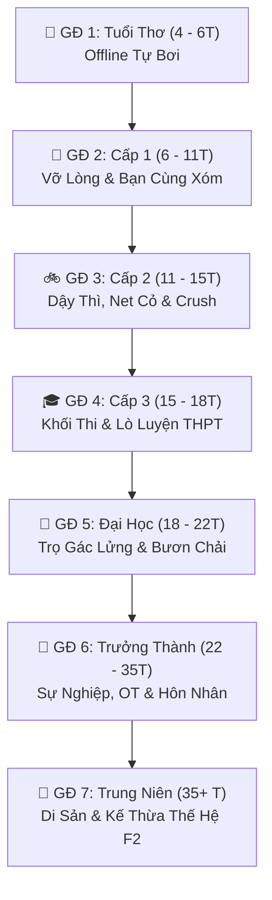

# ==============================================================================
#                 GÓC NHỎ CUỘC SỐNG (gocnhocuocsong.io)
#          TÀI LIỆU HỆ THỐNG Ý TƯỞNG & THIẾT KẾ GAME THEO MODULE (GDD)
# ==============================================================================

> **Thể loại:** Life Simulation / RPG Đời thực / Roguelite Kế thừa Thế hệ (Generation Legacy)  
> **Phong cách đồ họa:** 2D Pixel Art Hoài niệm Việt Nam  
> **Nền tảng:** Web-based (HTML5 Canvas + PHP & MySQL Backend + WebSocket Room)  
> **Tên miền dự án:** `gocnhocuocsong.io`

---

## 📑 MỤC LỤC CÁC MODULE HỆ THỐNG
1. [MODULE 1: TỔNG QUAN, TƯ TƯỞNG & TRIẾT LÝ GAME](#module-1-tổng-quan-tư-tưởng--triết-lý-game)
2. [MODULE 2: HỆ THỐNG 7 GIAI ĐOẠN CUỘC ĐỜI (LIFE STAGES)](#module-2-hệ-thống-7-giai-đoạn-cuộc-đời-life-stages)
3. [MODULE 3: HỆ THỐNG TƯƠNG TÁC ONLINE & MULTIPLAYER TOÀN DIỆN](#module-3-hệ-thống-tương-tác-online--multiplayer-toàn-diện)
4. [MODULE 4: HỆ THỐNG CHỈ SỐ, SINH TỒN & CƠ CHẾ "SIÊU NHÂN OT"](#module-4-hệ-thống-chỉ-số-sinh-tồn--cơ-chế-siêu-nhân-ot)
5. [MODULE 5: HỆ THỐNG KINH TẾ, NGHỀ NGHIỆP & THỊ TRƯỜNG ĐỘNG](#module-5-hệ-thống-kinh-tế-nghề-nghiệp--thị-trường-động)
6. [MODULE 6: HỆ THỐNG KÝ ỨC, CÁNH BƯỚM & DI SẢN KẾ THỪA F2](#module-6-hệ-thống-ký-ức-cánh-bướm--di-sản-kế-thừa-f2)
7. [MODULE 7: HỆ SINH THÁI ẢO (LIFEPHONE, ẨM THỰC & NHÀ Ở)](#module-7-hệ-sinh-thái-ảo-lifephone-ẩm-thực--nhà-ở)
8. [MODULE 8: KIẾN TRÚC KỸ THUẬT & LỘ TRÌNH TRIỂN KHAI](#module-8-kiến-trúc-kỹ-thuật--lộ-trình-triển-khai)

---

## MODULE 1: TỔNG QUAN, TƯ TƯỞNG & TRIẾT LÝ GAME

### 1.1. Triết lý Thiết kế Cốt lõi
* **"Chạm vào cảm xúc đời thực":** Tái hiện chân thực văn hóa, thói quen và những cột mốc đáng nhớ của đời người Việt Nam (từ tiếng ve kêu trưa hè mầm non, xe đạp cọc cạch cấp 2, áp lực lò luyện thi cấp 3, căn phòng trọ sinh viên 15m² đến áp lực KPI cơm áo gạo tiền).
* **"Mỗi lựa chọn là một sự đánh đổi":** Không có lối chơi nào hoàn hảo tuyệt đối. Người chơi chọn tiền tài thì hy sinh sức khỏe; chọn an nhàn thì thu nhập vừa đủ; chọn đam mê khởi nghiệp thì chịu rủi ro vỡ nợ.

### 1.2. 3 Tuyến Đường Đời Chính (Life Paths)
1. **Tuyến Học Thuật & Ổn Định (Corporate Ladder):**  
   Học sinh giỏi $\rightarrow$ Đại học danh tiếng $\rightarrow$ Nhân viên công sở / Chuyên gia $\rightarrow$ Thăng tiến theo cấp bậc $\rightarrow$ Mua chung cư trả góp, bảo hiểm hưu trí.
2. **Tuyến Đam Mê & Mạo Hiểm (Creative / Entrepreneur):**  
   Tự học vẽ truyện / lập trình game / làm streamer / mở chuỗi cafe $\rightarrow$ Khởi đầu bấp bênh, chịu định kiến xã hội $\rightarrow$ Nếu thành công sẽ đạt danh vọng lớn và tự do tài chính.
3. **Tuyến Bươn Chải Mưu Sinh & Cày Cuốc (Hustler / Overtime):**  
   Đi làm sớm, nhận nhiều ca kíp, bật cơ chế OT tối đa $\rightarrow$ Tích lũy tiền mặt cực nhanh, mua đất sớm nhưng phải đối mặt với nguy cơ suy nhược cơ thể và cô độc.

---

## MODULE 2: HỆ THỐNG 7 GIAI ĐOẠN CUỘC ĐỜI (LIFE STAGES)



### Chi tiết từng giai đoạn:
* **Giai đoạn 1: Tuổi Thơ Xóm Nhỏ (4 – 6 tuổi)**
  * *Bối cảnh:* Căn nhà ấm cúng, sân chơi xóm nhỏ, trường mẫu giáo có xích đu và cầu trượt.
  * *Gameplay:* Tự do khám phá (Offline), chơi minigame xếp gạch, vẽ tranh sáp màu, nghịch đất nặn, nghe bà kể chuyện.
  * *Tác động:* Hình thành 4 chỉ số gốc: `IQ (Trí tuệ)`, `EQ (Cảm xúc)`, `STR (Thể lực)`, `ART (Sáng tạo)`.

* **Giai đoạn 2: Cấp 1 – Tuổi Vỡ Lòng (6 – 11 tuổi)**
  * *Bối cảnh:* Lớp học bàn gỗ khắc compa, khăn quàng đỏ, tiệm tạp hóa cổng trường.
  * *Gameplay:* Luyện chữ đẹp, bấm phím giải bảng cửu chương, nhận tiền tiêu vặt (5k–10k/ngày), mua quà vặt (kem que, kẹo C, bánh tráng).
  * *Cột mốc:* Giấu bài kiểm tra điểm kém hay báo bố mẹ; ngày họp phụ huynh cuối kỳ.

* **Giai đoạn 3: Cấp 2 – Dậy Thì & Quán Net Cỏ (11 – 15 tuổi)**
  * *Bối cảnh:* Chiếc xe đạp cọc cạch, lò học thêm buổi tối, quán Net xóm phảng phất mùi mì tôm trứng.
  * *Gameplay:* Cân bằng giữa "Học sinh gương mẫu" và "Chỉ số Nổi loạn"; cảm nắng bạn cùng bàn (Crush); cúp học cày game kiếm danh hiệu quán net.
  * *Cột mốc:* Kỳ thi chuyển cấp vào Lớp 10 (Trường Chuyên, Công lập top hay Dân lập).

* **Giai đoạn 4: Cấp 3 – Áo Dài Trắng & Ngã Rẽ Đại Học (15 – 18 tuổi)**
  * *Bối cảnh:* Bảng đen đầy công thức ôn thi, quán trà sữa tuổi teen, đêm bế giảng trao lưu bút.
  * *Gameplay:* Chọn khối thi chuyên sâu (Khối A, B, C, D) hoặc định hướng học nghề; quản lý thời gian luyện đề xuyên đêm.
  * *Cột mốc:* Tỏ tình trước ngày bế giảng; Nhận kết quả kỳ thi THPT Quốc Gia.

* **Giai đoạn 5: Đời Sinh Viên – Phòng Trọ Gác Lửng & Bươn Chải (18 – 22 tuổi)**
  * *Bối cảnh:* Căn phòng trọ 15m² gác lửng nóng bức, xe bus giờ cao điểm, căn tin trường.
  * *Gameplay:* Quản lý ngân sách sinh tồn (Tiền trọ, điện nước, ăn uống, học phí); Đi làm thêm (Gia sư, bưng cafe, shipper, freelance code/design); Cân bằng tam giác: `GPA` $\leftrightarrow$ `Thu nhập` $\leftrightarrow$ `Sức khỏe`.
  * *Mục tiêu:* Tậu chiếc xe máy cũ đầu đời (Wave Alpha), mua laptop cá nhân, tốt nghiệp đại học.

* **Giai đoạn 6: Bước Vào Đời – Sự Nghiệp, Tài Sản & Hôn Nhân (22 – 35 tuổi)**
  * *Bối cảnh:* Tòa cao ốc văn phòng, nhà hàng tiệc cưới, thị trường chứng khoán / nhà đất.
  * *Gameplay:* Leo thang danh vọng (Intern $\rightarrow$ Senior $\rightarrow$ Leader/CEO); Bật chế độ "Siêu nhân OT" săn thưởng; Hẹn hò, kết hôn, sinh con; Mua sắm trả góp căn hộ, ô tô.

* **Giai đoạn 7: Trung Niên & Di Sản Kế Thừa (35+ tuổi & Thế Hệ F2)**
  * *Bối cảnh:* Nhà riêng tiện nghi, ban công trà đạo, phòng khách sum vầy con cháu.
  * *Gameplay:* Nuôi dạy con cái, chuẩn bị tài sản thừa kế; Nghỉ hưu an nhàn; Xuất bản "Thẻ Hồi Ký Cuộc Đời".
  * *Kế thừa:* Mở khóa **New Game+ F2** (Nhân vật đời con thừa kế một phần Net Worth và Buff gia tộc từ đời cha mẹ).

---

## MODULE 3: HỆ THỐNG TƯƠNG TÁC ONLINE & MULTIPLAYER TOÀN DIỆN

Hệ thống kết nối cộng đồng từ Giai đoạn 2 trở đi, kết hợp linh hoạt giữa cơ chế thời gian thực (Realtime Room) và thị trường bất đồng bộ (Asynchronous Economy):

| Giai đoạn | Tính năng Online Cốt lõi | Cơ chế Tương tác | Lợi ích In-Game |
| :--- | :--- | :--- | :--- |
| **🎒 Cấp 1** | **Đấu Trí Cổng Trường 1v1** | Ghép đôi realtime 60s giải toán đố / đố vui | Nhận tiền tiêu vặt, kẹo que, danh hiệu "Thần đồng xóm" |
| **🎒 Cấp 1** | **Chợ Đổi Thẻ Bài Cổng Trường** | Đăng tin trao đổi thẻ bài ma thuật, yoyo limited | Hoàn thành bộ sưu tập hiếm để kích hoạt Buff may mắn |
| **🚲 Cấp 2** | **Party Quán Net Cỏ (2-4 người)** | Tạo phòng cùng bạn bè cày minigame bắn súng pixel/audition | Nhận Buff "Hưng phấn": Giảm 100% Stress, tăng tốc độ thao tác 15% |
| **🚲 Cấp 2** | **Bảng Xếp Hạng Học Đường** | Bảng vinh danh "Học Bá" vs "Đầu Gấu" theo từng cụm trường | Mở khóa danh hiệu xã hội, tăng sức hút (Charm) |
| **🎓 Cấp 3** | **Đấu Trường Thi Thử THPT Quốc Gia** | Kỳ thi online đếm ngược 15 phút mở định kỳ cuối tuần | Xếp hạng toàn server, nhận học bổng trường Đại học danh giá |
| **🎓 Cấp 3** | **Lưu Bút & Ghép Đôi Thanh Xuân** | Gửi thiệp chúc ẩn danh, tặng trà sữa in-game | Tăng chỉ số Tình cảm & mở khóa kỷ niệm đẹp thời học trò |
| **🍜 Đại Học** | **Hệ Thống Ở Ghép Phòng Trọ (Roommate)** | 2 người chơi cùng share 1 căn trọ gác lửng 15m² | Giảm 50% tiền trọ & điện nước; hỗ trợ nấu cơm, dọn dẹp chung |
| **🍜 Đại Học** | **Chợ Trời Đồ Cũ Sinh Viên** | Mua bán trao đổi xe cũ, laptop cũ, giáo trình | Tiết kiệm chi phí đầu tư công cụ học tập và làm việc |
| **🍜 Đại Học** | **Sàn Đấu Thầu Job Freelance** | Người chơi đấu thầu nhận việc do NPC / Player khác đăng | Tăng thu nhập thực tế, rèn luyện kỹ năng chuyên môn |
| **💼 Trưởng Thành**| **Thị Trường BĐS & Cổ Phiếu Đồng Bộ** | Giá đất các quận và cổ phiếu biến động theo cung cầu server | Đầu tư lướt sóng, sinh lời từ dòng tiền nhàn rỗi |
| **💼 Trưởng Thành**| **Thành Lập Start-up / Doanh Nghiệp** | Thuê Avatar của người chơi khác làm nhân viên trong công ty | Nhận dự án lớn tạo nguồn thu hàng trăm triệu/tháng |
| **💼 Trưởng Thành**| **Đám Cưới Online & Phong Bì Mừng** | Tổ chức tiệc cưới, phát thiệp mời toàn server | Nhận tiền phong bì mừng cưới từ khách mời để mua nhà |
| **🏡 Trung Niên** | **Gia Tộc Kế Thừa (Clan Dynasty)** | Đóng góp tài sản xây dựng Nhà thờ họ, quỹ khuyến học | Hậu duệ F2 nhận ngay buff xuất phát điểm gia đình hào môn |

---

## MODULE 4: HỆ THỐNG CHỈ SỐ, SINH TỒN & CƠ CHẾ "SIÊU NHÂN OT"

### 4.1. Hệ thống Thời gian (Time Engine)
* **Tỷ lệ:** 24 giờ in-game = 45 phút ngoài đời thực.
* 1 giờ in-game = 112.5 giây thực tế | 1 phút in-game = 1.88 giây thực tế.
* 4 khung giờ: Sáng (06:00 - 12:00) $\rightarrow$ Chiều (12:00 - 18:00) $\rightarrow$ Tối (18:00 - 24:00) $\rightarrow$ Đêm (00:00 - 06:00).

### 4.2. Bộ Chỉ số Nhân vật (Character Stats Matrix)
* **Chỉ số Sinh tồn:**
  * `Stamina (Thể lực)`: Giảm dần khi hoạt động; hồi phục qua ngủ và ăn uống.
  * `Mental / Stress (Tinh thần)`: Tăng cao khi học thi, OT; giảm khi giải trí, hẹn hò, ăn ngon.
  * `Hunger (Độ đói)`: Cần nạp thức ăn mỗi ngày để duy trì thể lực.
* **Chỉ số Kỹ năng:**
  * `IQ (Trí tuệ)`: Tác động đến điểm thi cử, nghiên cứu công nghệ.
  * `EQ / Charm (Cảm xúc & Sức hút)`: Tác động đến tán tỉnh, ngoại giao, đàm phán hợp đồng.
  * `STR (Thể chất)`: Tăng sức chịu đựng, giảm nguy cơ ốm đau.
  * `Creativity (Sáng tạo)`: Mở khóa các công việc nghệ thuật, thiết kế, làm nội dung.
  * `Net Worth (Tài sản ròng)`: Tổng tiền mặt + Giá trị tài sản quy đổi.

### 4.3. Cơ chế Sinh tồn & "Siêu Nhân OT" (Overtime Survival)
* **Quy tắc giấc ngủ:** Tối thiểu phải ngủ 5 tiếng/ngày. Nếu thức trắng $\rightarrow$ Ngất xỉu, mất 1 ngày nằm viện + viện phí đắt đỏ.
* **Chế độ Overtime (OT tối đa 16 tiếng/ngày):**
  * *Ưu điểm:* Tiền lương nhân 1.5x - 2.0x, tiến độ công việc tăng gấp đôi.
  * *Hậu quả:* Thanh Stress chuyển màu đỏ, xuất hiện quầng thâm mắt (giảm Charm), tụt tuổi thọ và giảm chỉ số gia đình.

---

## MODULE 5: HỆ THỐNG KINH TẾ, NGHỀ NGHIỆP & THỊ TRƯỜNG ĐỘNG

### 5.1. Hai Mô hình Việc làm
1. **Công việc Cố định (Contract Jobs):**
   * *Đăng ký qua ứng dụng:* Chọn ca sáng/chiều/tối trên App *GocJob*.
   * *Ví dụ:* Nhân viên phục vụ quán cafe, Lập trình viên tại cty IT, Giáo viên, Chuyên viên tài chính.
   * *Đặc điểm:* Thu nhập ổn định, đóng bảo hiểm, có lộ trình thăng cấp (Intern $\rightarrow$ Senior $\rightarrow$ Director).
2. **Công việc Tự do (Freelance / Gig Economy):**
   * *Chủ động bật/tắt:* Thích làm lúc nào bật app lúc đó.
   * *Ví dụ:* Chạy xe ôm công nghệ (GocBike), phát tờ rơi, làm shipper giao đồ ăn, nhận freelance thiết kế banner/logo.
   * *Đặc điểm:* Thu nhập bấp bênh theo giờ, không có bảo hiểm nhưng linh hoạt thời gian.

### 5.2. Hệ thống Tài sản & Đầu tư
* **Bất động sản:** Thuê trọ $\rightarrow$ Thuê chung cư $\rightarrow$ Mua chung cư trả góp $\rightarrow$ Mua nhà phố $\rightarrow$ Biệt thự ven đô.
* **Phương tiện di chuyển:** Đi bộ $\rightarrow$ Xe bus $\rightarrow$ Xe máy cũ (Wave) $\rightarrow$ Xe tay ga (SH) $\rightarrow$ Ô tô cá nhân.
* **Kênh sinh lời:** Gửi tiết kiệm ngân hàng V-Bank (lãi ngày), đầu tư cổ phiếu, mua gom đất nền.

---

## MODULE 6: HỆ THỐNG KÝ ỨC, CÁNH BƯỚM & DI SẢN KẾ THỪA F2

### 6.1. Hiệu ứng Cánh Bướm Tuổi Thơ (Butterfly Trait System)
Mỗi sự kiện thời thơ ấu tạo ra các thuộc tính vĩnh viễn:
* *Ký ức: Bố mua máy tính sớm* $\rightarrow$ **Trait "Thiên phú Công nghệ"** (Tốc độ học IT +25%).
* *Ký ức: Từng trượt học sinh giỏi* $\rightarrow$ **Trait "Cầu toàn Ám ảnh"** (Hiệu suất làm việc +10% nhưng Stress tăng nhanh hơn 15%).
* *Ký ức: Trực nhật giúp bạn bè* $\rightarrow$ **Trait "Trượng nghĩa"** (Dễ kết thân đồng nghiệp, được sếp ưu ái).

### 6.2. Sợi Dây Tình Cảm Gia Đình (Family Bond & Aging)
* Cha mẹ già đi theo từng năm trong game.
* Tương tác định kỳ: Gọi điện về nhà, gửi tiền phụng dưỡng, về quê ăn Tết.
* Nếu lơ là cha mẹ: Nhận sự kiện hối hận muộn màng, ảnh hưởng sâu sắc đến tâm lý nhân vật lúc về già.

### 6.3. Cơ chế Thế Hệ Kế Thừa (Roguelite New Game+ F2)
* Khi nhân vật đời F1 hoàn thành cuộc đời (qua đời hoặc về hưu sau khi viết xong "Hồi Ký Cuộc Đời"):
  * Tài sản ròng được quy đổi thành **Quỹ Di Sản Gia Tộc**.
  * Thế hệ F2 bắt đầu lại từ 4 tuổi với các buff xuất phát điểm: Nhà ở rộng rãi hơn, vốn khởi nghiệp có sẵn, thừa hưởng gen thông minh/nghệ thuật từ bố mẹ.

---

## MODULE 7: HỆ SINH THÁI ẢO (LIFEPHONE, ẨM THỰC & NHÀ Ở)

### 7.1. Điện Thoại Ảo In-Game (LifePhone OS)
Giao diện điện thoại cảm ứng pixel trực quan trên góc màn hình:
* 💬 **Zola:** Nhắn tin tâm sự với bạn bè, người yêu, nhận tin nhắn từ mẹ.
* 💼 **GocJob:** Quản lý ca làm việc, đấu thầu dự án freelance.
* 🏦 **V-Bank:** Chuyển khoản, gửi tiết kiệm, thanh toán tiền nhà & điện nước.
* 🛍️ **ShopeeGoc:** Mua sắm quần áo thời trang, bàn học, máy tính xịn, đồ trang trí phòng trọ.
* 🗺️ **GocMaps:** Định vị các địa điểm trong thành phố (Trường học, Quán Net, Công ty, Bệnh viện).

### 7.2. Văn Hóa Ẩm Thực Đường Phố & Hệ Thống Buff
* 🍜 **Mì tôm trứng xúc xích:** Chi phí 10.000đ $\rightarrow$ Hồi 40 thể lực, ăn nhiều 3 ngày liên tiếp nhận debuff "Nóng trong người".
* ☕ **Cà phê sữa đá vỉa hè:** Chi phí 15.000đ $\rightarrow$ Buff "Tỉnh táo": Tăng 20% tốc độ làm việc/học tập trong 2 giờ game.
* 🍱 **Cơm tấm sườn bì chả / Phở bò:** Chi phí 45.000đ $\rightarrow$ Hồi 100% thể lực, giải tỏa 50% stress.

---

## MODULE 8: KIẾN TRÚC KỸ THUẬT & LỘ TRÌNH TRIỂN KHAI

### 8.1. Kiến Trúc Công Nghệ
```
[ Client (Browser) ]
  ├── HTML5 / CSS (Vanilla UI & Responsive)
  ├── Canvas 2D Engine (Render Thế giới Pixel Art, Nhân vật, Bản đồ)
  └── LifePhone Web Component (Giao diện ứng dụng ảo)
         ▲
         │ (HTTP REST API / JSON + WebSocket)
         ▼
[ Server Backend ]
  ├── PHP RESTful API (Xử lý Logic Tài khoản, Lưu trữ Save Data, Chợ giao dịch)
  ├── MySQL Database (Lưu Users, Stats, Inventory, Leaderboard, Roommates)
  └── WebSocket Server (Node.js hoặc Ratchet PHP cho Đấu trí 1v1 & Party Quán Net)
```

### 8.2. Lộ Trình Phát Triển Từng Bước (Development Phases)
* **Giai đoạn Alpha (Core Engine & Tuổi Thơ - Cấp 1):**
  * Xây dựng Vòng lặp Thời gian (Time Loop), Hệ thống Chỉ số & Di chuyển Canvas.
  * Hoàn thiện Giai đoạn 4-6 tuổi và Cấp 1 (Minigame giải toán, chợ đổi đồ chơi).
* **Giai đoạn Beta 1 (Cấp 2 & Cấp 3):**
  * Tích hợp Quán Net xóm, Luyện thi THPT, Đấu trường thi thử online.
  * Tích hợp LifePhone & Hệ thống nhắn tin Zola.
* **Giai đoạn Beta 2 (Đại Học & Phòng Trọ Gác Lửng):**
  * Cơ chế ở ghép phòng trọ, công việc part-time, chợ đồ cũ sinh viên.
* **Giai đoạn Hoàn Thiện (Trưởng Thành, BĐS & Di Sản F2):**
  * Cơ chế "Siêu nhân OT", Thị trường chứng khoán/BĐS, Đám cưới, New Game+ F2.
  * Bảng xếp hạng online toàn server `gocnhocuocsong.io`.
